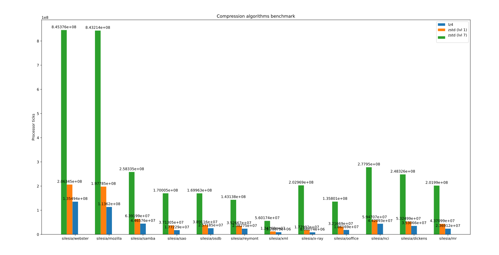
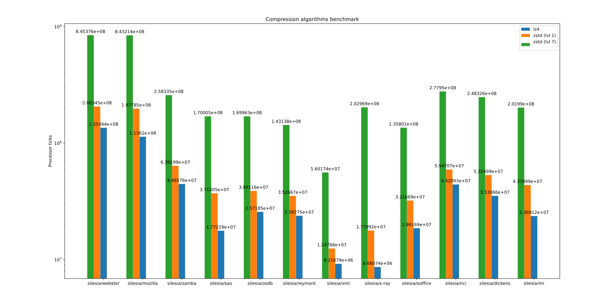
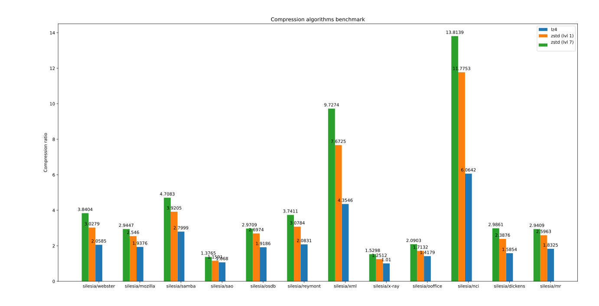

# Отчет

## Описание работы программы

Программа принимает на вход директорию, в которой содержатся файлы, на которых будет
проведено тестирование. Перед началом стресс тестирования выполняются проверки корректности
работы архиваторов на случайных данных. Когда проверка корректности завершена,
программа сжимает содержимое каждого файла каждым алгоритмом, сохраняя информацию о том,
сколько времени (в тиках процессора) занял процесс сжатия содержимого файла и то,
насколько оно сжалось. Весь этот процесс повторяется 20 раз для получения
более более точного среднего времени работы каждого алгоритма на каждом файле.
Время замеряется с помощью функции `std::chrono::steady_clock::now().time_since_epoch().count()`.

## Запуск

Подробная инструкция по сброке и запуску приведена в корне в файле `README.md`.

Для получения графиков ниже я запускал программу следующим способом:

### Генерация данных

```bash
./build/compression-bench silesia/ results/
```

### Создание графиков

```bash
./benchmark_graph.py results/compression.csv 'Compression ratio'
./benchmark_graph.py results/speed.csv 'Processor ticks'
```

## Результаты

### Время работы

#### Линейная шкала



#### Логарифмическая шкала



Тут, кажется, ничего необычного нет.
Как и ожидалось: алгоритмы, которые
работают лучше, делают это сильно дольше.
Тут этот принцип работает без исключений.

### Сжатие



Тут можно провести наблюдения о том,
на каких файлах алгоритмы сжатия работают
лучше, а на каких - хуже.

Например, до этого
я абсолютно случайно попробовал сжать много `.bz2`
файлов, но ничего толкового из этого не вышло:
все сжатия были от 0.98 до 1.01. Это подтверждает
то, что архив и правда использует довольно хороший
алгоритм:)

Рассмотрим файлы, которые сжались хуже всего
: `sao`, `x-ray` и `ooffice`. У них есть общая
отличительная черта: они бинарные. Изученные
алгоритмы сжатия работают хорошо тогда, когда
в файле есть много повторяющихся паттернов. А
от бинарных файлов мы обычно и не ожидаем, что
в них есть какие-то синтаксические конструкции,
которые упрощают его текста для человека,
ведь люди эти файлы не читают.

Напротив, файлы, которые сжались лучше всего:
`xml`, `nci`. С `nci` всё понятно:
это просто текстовый файл, заглянув в который
можно увидеть, что в нём очень много повторяющихся паттернов, таких как нулей с пробелами. C `xml` всё тоже ясно: хоть
этот файл и является архивом, но на самом деле это просто сконкатенированное множество
файлов, никак не сжатое. А внутри хранятся
привычные для человека `.xml` файлы, которые
очень красиво размечены и отлично считаются,
но очевидно, что для компютера не нужно столько лишнего синтаксиса для прочтения файла, алгоритмы там находят много повторяющихся паттернов и с лёгкостью
сжимают файлы.

Из моих мыслей выше хочется сделать
довольно очевидный вывод, что наличие человека и его
очень высоких требованих для красоты языка (кода, разметки и т.д.) очень сильно увеличивает объём любой информации, от которой
нужно, чтобы она была читаема человеком. Иногда даже в десятки раз от необходимого минимума.
