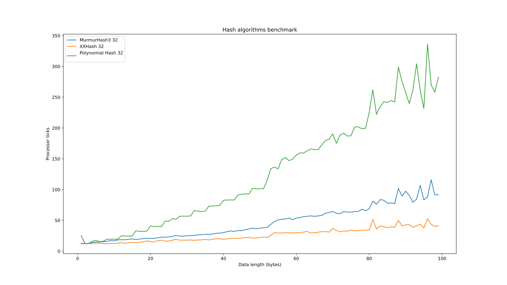
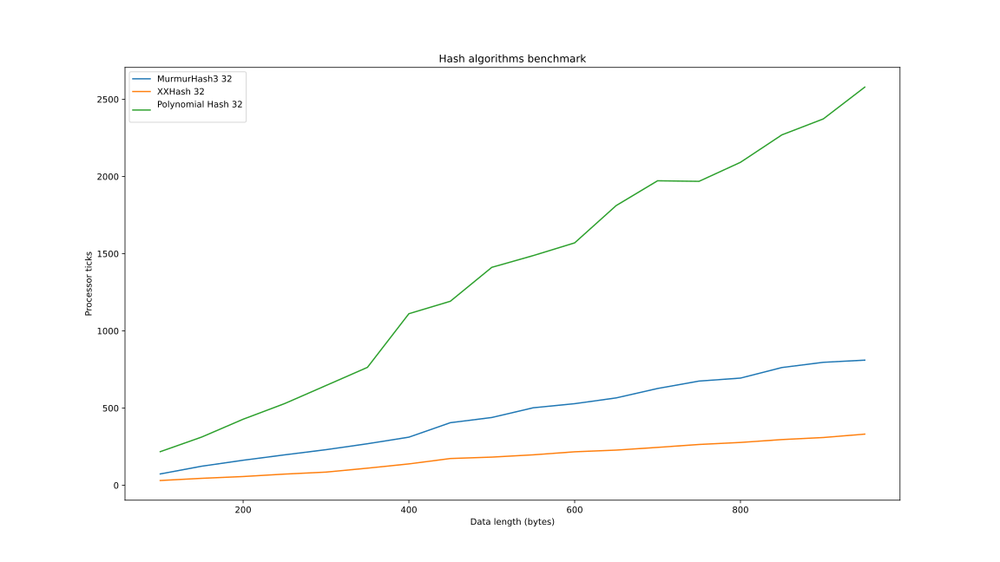

# Отчет

## Описание работы программы

Программа для каждой длины данных, проводит 10^6 тестов. Каждый тест состоит из из двух этапов:

- Сгенерировать случайные данные
- Замерить время хеширования этих данных каждым хеширующим алгоритмом.

Для получения среднего времени работы каждого алгоритма на данных каждой длины берётся среднее арифметическое по всем
запускам.

## Запуск

Подробная инструкция по сброке и запуску приведена в корне в файле `README.md`.

Для получения графиков ниже я запускал программу следующим способом:

### Генерация данных
```bash
./build/hash-bench 1 100 1 1-100.csv
./build/hash-bench 100 1000 50 100-1000.csv
```

### Создание графиков
```bash
./benchmark_graph.py 1-100.csv 1 100 1
./benchmark_graph.py 100-1000.csv 100 1000 50
```

## Результаты

### Используемые алгоритмы

Для тестирования я выбрал самые свежие 32 битные версии каждого
алгоритма. Возможно, что они работают медленнее,
из-за того, что читают данные меньшими порциями,
но всё равно отражают основной алгоритм. Плюс
было проще реализовать 32 битную версию полиномиального
хеша, который я выбрал третьим алгоритмом.
Выбран полиномиальный хеш, так как он самый простой
для самостоятельной реализации, интересно как он работает
по сравнению с быстрыми современными алгоритмами.

- [MurmurHash3_x86_32](https://github.com/aappleby/smhasher)

- [XXH32](https://github.com/Cyan4973/xxHash)

- Polynomial Hash 32 (собственная реализация)

### Полученные графики

#### Размер данных от 1 до 100 байт с шагом 1



#### Размер данных от 100 до 1000 байт с шагом 50


